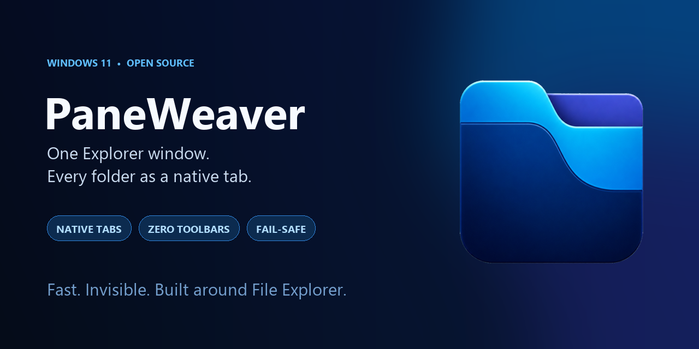
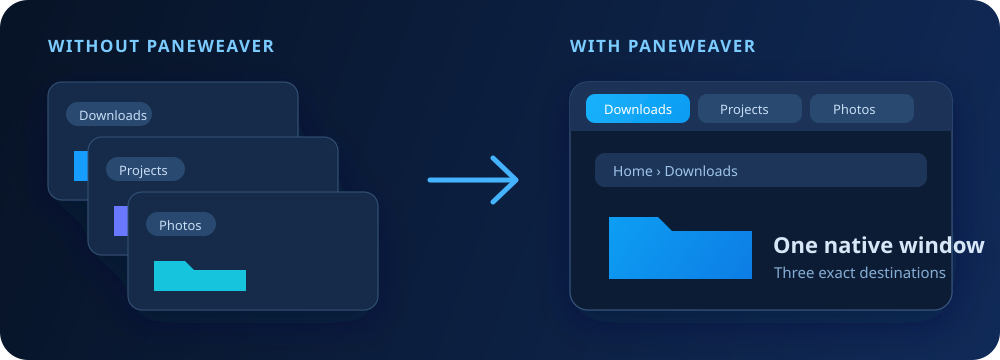

<div align="center">


# PaneWeaver

### One Explorer window. Every folder as a native tab.

[](https://github.com/DopaLab/PaneWeaver/releases/latest)
[](https://github.com/DopaLab/PaneWeaver/releases)
[](https://github.com/DopaLab/PaneWeaver/actions/workflows/build.yml)
[](https://github.com/DopaLab/PaneWeaver/stargazers)
[](LICENSE)

[](https://github.com/DopaLab/PaneWeaver/releases/latest)
[](https://ko-fi.com/fgtranime)

</div>



PaneWeaver is a tiny Windows 11 companion that turns new File Explorer windows into **real native tabs** inside your existing Explorer window. It adds no toolbar, no replacement tab strip, and no extra frame around Explorer.

External folder launches, shortcuts, detached tabs, and `Win + E` stay in one clean Explorer window. PaneWeaver targets the exact tab it created, so browsing somewhere else while a folder opens cannot redirect the wrong tab.

> [!IMPORTANT]
> PaneWeaver is currently unsigned. Windows SmartScreen may show **Windows protected your PC** on first launch. Choose **More info → Run anyway** if you downloaded it from this repository.

## Why PaneWeaver?

Windows 11 added tabs to File Explorer, but folders opened from the desktop, Start, other apps, and many shortcuts can still create separate windows. Most workarounds either add visible UI, replace Explorer, or wait for a window to appear before pasting its location elsewhere.

PaneWeaver takes a more direct approach:

| | PaneWeaver |
|---|---|
| Explorer interface | 100% native |
| Added title bars or toolbars | None |
| Folder destination | Sent to the exact newly created tab |
| Rapid concurrent launches | Serialized safely |
| `Win + E` | Opens a native tab immediately |
| Failure behavior | Restores the normal Explorer window |
| Administrator access | Not required |
| Analytics or network traffic | None |

<div align="center">
  
</div>

## Features

- **Native Explorer tabs** — no custom tab UI and no Explorer replacement.
- **Invisible interception** — catches the new Explorer window at creation and cloaks it before routing.
- **Race-proof navigation** — identifies the exact native tab through Explorer's Shell COM collection.
- **Fast repeated opens** — queues simultaneous folder launches so destinations never cross.
- **Smarter `Win + E`** — creates a tab directly when Explorer is already open.
- **One-time bypass** — hold `Shift` while opening a folder when you intentionally want another window.
- **Fail-open safety** — if routing cannot be confirmed, the original Explorer window is restored.
- **Lightweight tray controls** — pause routing, open a tab, view activity, or disable startup.
- **Private by design** — no telemetry, accounts, services, ads, or internet access.

## Install

1. Download the latest [`PaneWeaver-1.0.0-win-x64.zip`](https://github.com/DopaLab/PaneWeaver/releases/latest).
2. Extract the ZIP anywhere.
3. Double-click **`Install PaneWeaver.cmd`**.
4. If SmartScreen appears, choose **More info → Run anyway**.

PaneWeaver installs for your Windows user under `%LOCALAPPDATA%\PaneWeaver`, starts with Windows, and places a small icon in the notification area. It does **not** require administrator privileges or replace the default folder association.

## Everyday use

| Action | Result |
|---|---|
| Open a folder from Desktop, Start, a shortcut, or another app | Opens as a tab in your last Explorer window |
| Press `Win + E` while Explorer is open | Creates a new native Explorer tab |
| Browse inside the current Explorer tab | Works normally |
| Open several folders quickly | Each path reaches its own correct tab |
| Hold `Shift` while opening a folder | Allows one separate Explorer window |
| Double-click the tray icon | Opens a new Explorer tab |

Right-click the tray icon to pause routing, toggle startup, open the activity log, disable PaneWeaver, or exit until your next sign-in.

## How it works

PaneWeaver deliberately avoids simulated typing and clipboard tricks.

1. A Windows accessibility event reports a new `CabinetWClass` Explorer window.
2. PaneWeaver hides the new window using DWM cloaking when available, with a reversible transparency fallback.
3. Explorer's Shell COM object provides the requested folder path.
4. PaneWeaver invokes Explorer's native internal **new tab** command.
5. The newly created native tab HWND is resolved to its exact Shell browser object and navigated to the captured path.
6. After the destination is observed and the source is checked again, the hidden source window closes. If confirmation fails, it is restored.

The broker uses a pumped STA with asynchronous requests. Only native tab creation is serialized; destination readiness and navigation can overlap. It does not use list indexes or the active tab to choose a destination. The Win+E path needs no COM lookup at all.

### Performance, honestly

Version 1.1 targets sub-second interaction. Warm new-tab requests are substantially cheaper than capturing an external Explorer window, which Windows must first create and register. Cold starts, many tabs, burst launches, slow drives, and shell extensions can take longer. There is no universal sub-second or zero-flicker guarantee. See the [measured results and reproducible harness](docs/TESTING.md).

A separate watchdog restores captured windows if routing exceeds its 3-second recovery budget. That is a recovery threshold, **not** a promised completion time. PaneWeaver never closes a source on an unconfirmed transfer.

See [Architecture](docs/ARCHITECTURE.md) for the deeper implementation notes and [Verification](docs/TESTING.md) for live test results.

## Compatibility

- Windows 11 x64, version 22H2 or newer
- Native File Explorer tabs enabled
- No separate .NET installation required for release builds

Verified on Windows 11 Pro 24H2, build 26100.

> [!NOTE]
> Microsoft does not expose a documented public API for creating File Explorer tabs. PaneWeaver uses Explorer's internal native-tab command and checks every step. A future Windows feature update could change that command; the fail-open design keeps folder access available if that happens.

## Build from source

Requirements: Windows 11 and the .NET 8 SDK or newer.

```powershell
git clone https://github.com/DopaLab/PaneWeaver.git
cd PaneWeaver
dotnet build -c Release
```

To create the self-contained release:

```powershell
dotnet publish -c Release -r win-x64 --self-contained true `
  -p:PublishSingleFile=true `
  -p:PublishTrimmed=false `
  -p:IncludeNativeLibrariesForSelfExtract=true
```

## Roadmap

- [ ] Code-signed releases to remove the SmartScreen warning
- [ ] Configurable target-window preference
- [ ] Optional background-tab behavior
- [ ] ARM64 build and validation
- [ ] Windows Insider build compatibility checks

## Support the project

If PaneWeaver makes File Explorer calmer, you can help it grow:

- ⭐ **Star the repository** — it helps other Windows users discover the project.
- 🐛 [Report a bug](https://github.com/DopaLab/PaneWeaver/issues/new?template=bug_report.yml) with your Windows build number.
- 💡 [Suggest an improvement](https://github.com/DopaLab/PaneWeaver/issues/new?template=feature_request.yml).
- ☕ [Support development on Ko-fi](https://ko-fi.com/fgtranime) to help fund signing certificates, testing, and future releases.

<div align="center">

[](https://ko-fi.com/fgtranime)

</div>

## Contributing

Issues and pull requests are welcome. Please read [CONTRIBUTING.md](CONTRIBUTING.md) and keep changes focused. Security-sensitive reports should follow [SECURITY.md](SECURITY.md).

## Acknowledgements

- Microsoft's Win32 Shell, UI Automation, and File Explorer tab implementation
- The open-source Windows customization community, including the Windhawk Explorer tab experiments that helped validate the internal command path

## License

PaneWeaver is available under the [MIT License](LICENSE).

<div align="center">

Made for people who want File Explorer to simply stay organized.

</div>
